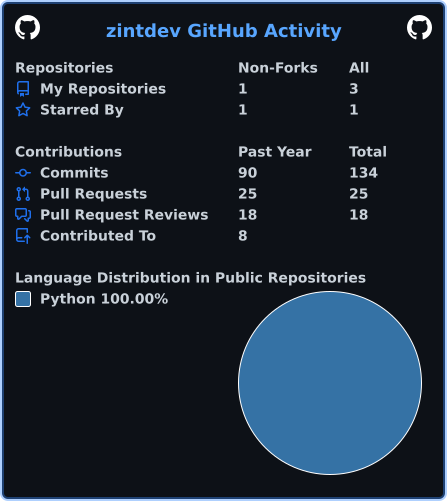

# Hi, I'm Trương Tấn Triệu 👋

### Data Engineer at FPT Software

I build cloud data pipelines, lakehouse architectures, analytics-ready datasets, and monitoring solutions with Microsoft Fabric, Azure, AWS, Spark, SQL, and Python.

---

## 💫 About Me

I am currently working at **FPT Software** as a **Data Engineer**, with responsibilities spanning data engineering and analytics.

My background is in **Software Engineering and backend development**. Before specializing in data engineering, I worked with Java, Spring Boot, PostgreSQL, REST APIs, JWT, Android, and frontend technologies. This foundation helps me design data platforms as maintainable software systems, with attention to architecture, reliability, integration, testing, and documentation.

- 🔭 Building data solutions with **Microsoft Fabric, Microsoft Azure, AWS, Apache Spark, SQL, and Python**
- ⚙️ Working with **ETL/ELT, batch processing, incremental loading, orchestration, data quality, and monitoring**
- 🏗️ Designing **Bronze–Silver–Gold lakehouse architectures**
- 🔌 Integrating data from **REST APIs, SAP OData, PostgreSQL, CSV, and JSON**
- 📊 Preparing analytics-ready datasets for reporting, customer analytics, and downstream analysis
- 🌏 **English:** Professional working proficiency
- 🇯🇵 **Japanese:** Basic communication, approximately JLPT N4 level; not certified

---

## 🚀 Featured Data Engineering Experience

### Microsoft Fabric Pipeline Logging & Monitoring Framework

A centralized monitoring solution for Microsoft Fabric data pipelines.

- Integrated Microsoft Fabric REST APIs to retrieve pipeline execution metadata
- Designed logging schemas for run IDs, pipeline names, timestamps, execution statuses, and error details
- Parsed and standardized nested JSON responses
- Stored historical execution metadata in Fabric Lakehouse tables
- Implemented validation and error handling for successful, failed, cancelled, and partially completed runs
- Investigated discrepancies between live pipeline statuses and historical logs

**Tech Stack:**  
`Microsoft Fabric REST API` `Fabric Lakehouse` `Fabric Data Pipeline` `SQL` `PySpark` `JSON`

---

### Azure Subscription & License Analytics Lakehouse

A team-based mock project for subscription analytics across more than **1 million synthetic SaaS records**.

- Designed an end-to-end Bronze, Silver, and Gold lakehouse
- Built ingestion workflows for CSV, PostgreSQL, REST APIs, and JSON usage events
- Developed PySpark and Spark SQL transformations for cleansing, standardization, deduplication, joins, and aggregation
- Applied Delta Lake ACID transactions, schema enforcement, and incremental processing
- Produced Gold-layer analytical tables for MRR, churn rate, customer lifetime value, and cohort retention
- Implemented data-quality checks and supported testing, monitoring, troubleshooting, and documentation

**Tech Stack:**  
`Python` `SQL` `PySpark` `Spark SQL` `Azure Databricks` `ADLS Gen2` `Azure Data Factory` `Apache Airflow` `Delta Lake`

---

### SAP HR Analytics Lakehouse on AWS

A cloud data platform for ingesting and transforming HR data from SAP OData services.

- Developed Python ingestion jobs to extract SAP HR data and store raw JSON responses in Amazon S3
- Organized datasets into Bronze, Silver, and Gold zones
- Built AWS Glue and PySpark jobs to cleanse, standardize, deduplicate, and integrate HR data
- Registered processed datasets in AWS Glue Data Catalog
- Used Amazon Athena and SQL for validation and downstream analysis
- Implemented reconciliation and data-quality checks for completeness, uniqueness, validity, and consistency

**Tech Stack:**  
`Python` `SQL` `PySpark` `Amazon S3` `AWS Glue` `AWS Glue Data Catalog` `Amazon Athena` `SAP OData`

---

### AICAMS Data Synchronization

A batch integration workflow supporting AI-oriented analysis.

- Developed batch jobs to synchronize data from Jira and GitHub APIs
- Standardized source data for downstream processing
- Focused on workflow reliability, data integrity, and cross-system consistency

**Tech Stack:**  
`Python` `REST APIs` `Jira API` `GitHub API` `Batch Processing`

---

### Customer Analytics with Applied Machine Learning

A customer analytics workflow for churn prediction and support-ticket sentiment analysis.

- Prepared model-ready datasets for customer churn prediction
- Processed more than **20,000 support tickets**
- Applied NLP sentiment analysis with Azure Cognitive Services
- Integrated scikit-learn into the analytics workflow

**Tech Stack:**  
`Python` `scikit-learn` `Azure Cognitive Services` `NLP` `Data Preparation`

---

## 🧩 Software Engineering Background

### JCD Store — Full-Stack Android E-commerce

A full-stack e-commerce platform for Japanese CDs, including a Spring Boot backend and an Android application.

**Role:** Team Leader & System Architect

- Designed the overall system architecture using Clean Architecture for the backend and MVVM for Android
- Designed PostgreSQL schemas and core business workflows
- Implemented backend security, authentication, authorization, and database features
- Coordinated tasks and technical decisions within the project team
- Implemented role-based access control for Admin, Staff, and User roles
- Built shopping cart, ordering, inventory, staff assignment, and order-management features
- Integrated Firebase Realtime Database for chat
- Integrated Google Maps for store locations and pickup-point selection
- Generated API documentation with SpringDoc and Swagger

**Backend:**  
`Spring Boot` `Spring Security` `JWT` `JPA/Hibernate` `PostgreSQL` `Firebase Admin SDK` `Swagger`

**Android:**  
`Java` `MVVM` `Retrofit2` `Glide` `Google Maps API` `Gradle`

[🔗 View the JCD Store organization](https://github.com/J-Disc-Store)

---

# 💻 Tech Stack & Tools

### Data Engineering & Analytics

  
  
  
  
  
  

### Cloud & Data Platforms

  
  
  
  
  
  
  
  

### Databases & Integration

  
  
  
  

### Software Engineering

  
  
  
  
  

### Tools

  
  
  
  
  
  

---

## 🎓 Certification

- **Microsoft Certified: Fabric Data Engineer Associate (DP-700)**

---

# 📊 GitHub Stats

The SVG is generated daily by GitHub Actions and stored inside this repository.

## 🏆 GitHub Trophies

| 🤝 Pair Extraordinaire | 🦈 Pull Shark ×2 | 🚀 YOLO | ⚡ Quickdraw |
|:---:|:---:|:---:|:---:|
| Co-authored commits | Merged pull requests | Merged without review | Closed an issue or PR quickly |

### ✍️ Random Dev Quote

<!-- DEV_QUOTE_START -->
> “Make it work, make it right, make it fast.” — Kent Beck
<!-- DEV_QUOTE_END -->
---

## 🌐 Socials

